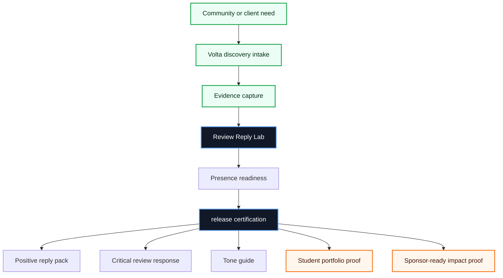
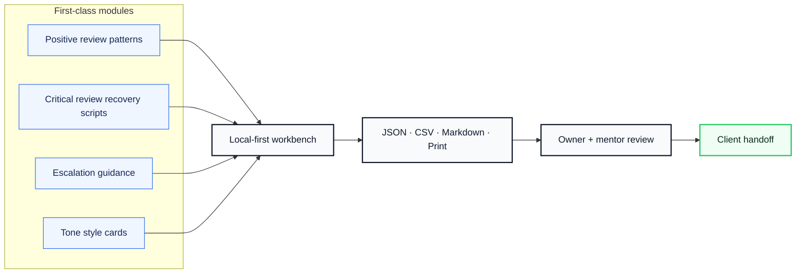
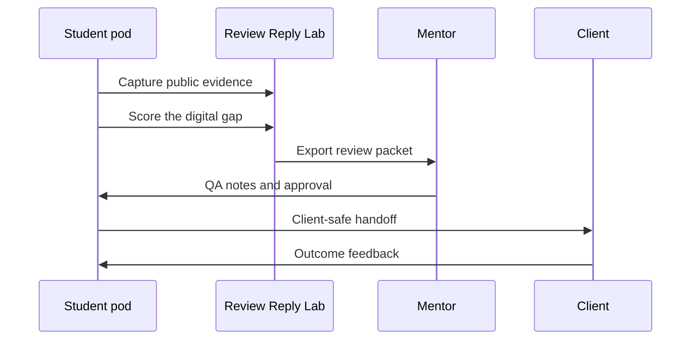

<div align="center">

# 🌐 Review Reply Lab

### Privacy-first review response drafts that teach owners how to reply with empathy and local voice.


**Digital Presence** · **No backend. No login. Client data stays local.**

[Live app](https://volta-npo.github.io/review-reply-lab/) · [Report an issue](https://github.com/volta-npo/review-reply-lab/issues) · [Volta](https://voltanpo.org)

</div>

---

## ✨ What it does

**Review Reply Lab** is a polished, local-first open-source tool from Volta's open-source program. It helps Marketing pods managing reputation for clients turn real community work into structured evidence, client-safe handoffs, and mentor-reviewable release packets.

> **Volta principle:** digital equity is economic equity. Every tool in this collection is designed so students can ship useful, accountable technology for small businesses, nonprofits, and community organizations that are usually priced out of high-quality digital transformation.

### The gap it closes

Review response tools are often paid, generic, or risky with customer data.

### The niche

Independent businesses learning reputation management.

### North-star metric

`reviews answered with owner-approved responses`

---

## 🧭 Product map







---

## 🟦 TypeScript-first

This repository is authored in **TypeScript**. The checked-in JavaScript files are compiled artifacts so the project can run directly on GitHub Pages without a build server.

- Source: `src/**/*.ts` and `test/**/*.ts`
- Build: `npm run build`
- Runtime artifacts: `src/**/*.js` for static hosting

---

## 🚀 Features

| Area | What ships in this release |
|---|---|
| **Domain workbench** | A purpose-built response lab interface for privacy-first review response drafts that teach owners how to reply with empathy and local voice. |
| **Local-first runtime** | Runs as a static web app with local autosave and no server dependency. |
| **Certification flow** | Release gates require status, owner, severity, and evidence before production handoff. |
| **Exports** | JSON release bundle, CSV operational table, Markdown certification report, print-ready handoff. |
| **Integrity** | Deterministic certification hash detects changed evidence. |
| **Safety** | Privacy notes, secret-safe markdown checks, wrong-product import rejection, client-safe defaults. |
| **Accessibility** | Skip links, keyboard-friendly controls, ARIA meter/list semantics, high-contrast focus support. |

---

## 🧩 Modules

| # | Module | Why it matters |
|---:|---|---|
| 1 | **Positive review patterns** | Converts field work into repeatable, reviewable Volta delivery evidence. |
| 2 | **Critical review recovery scripts** | Converts field work into repeatable, reviewable Volta delivery evidence. |
| 3 | **Escalation guidance** | Converts field work into repeatable, reviewable Volta delivery evidence. |
| 4 | **Tone style cards** | Converts field work into repeatable, reviewable Volta delivery evidence. |

---

## ✅ Production acceptance

| Gate | Acceptance signal |
|---:|---|
| 1 | public evidence captured |
| 2 | owner handoff is plain-English |
| 3 | accessibility basics checked |
| 4 | local SEO output exported |

<details>
<summary><strong>Full release quality gates</strong></summary>

- All exports work offline
- Privacy and data handling documented
- No blocked critical gates
- Every certified claim has evidence
- Import rejects wrong product bundles
- Release hash is deterministic
- Client-safe markdown contains no secrets
- CSV contains every operational row
- Critical reviews require escalation check
- Owner approval before ready
- No private customer data

</details>

---

## 🏗️ Production infrastructure

This repo is designed to be usable as a real OSS product, not just a static demo.

| Layer | Included |
|---|---|
| Reproducible build | `package-lock.json`, `npm ci`, TypeScript build artifacts |
| Local runtime | Static app via `npm start` |
| Container runtime | `Dockerfile`, `docker-compose.yml`, hardened Nginx config |
| Developer environment | `.devcontainer/devcontainer.json` |
| Operations | `Makefile`, `.env.example`, deployment docs, API docs |
| CI/CD | GitHub Actions CI, release artifact workflow, Dependabot |

---

## 🛠️ Quick start

```bash
git clone https://github.com/volta-npo/review-reply-lab.git
cd 08-review-reply-lab
npm install
npm test
npm start
```

Then open the local URL shown by Python, usually:

```text
http://localhost:4173
```

No install step is required for the app itself. Tests use Node's built-in test runner.

---

## 🧪 Validation

This repository includes **25 automated tests** covering core scoring, domain behavior, v1 release behavior, and release certification.

```bash
npm test
```

Test coverage includes:

- configuration weights and launch readiness
- product-specific domain sample data
- artifact generation and markdown exports
- v1 launch packet behavior
- release import/export round trips
- wrong-product import rejection
- deterministic integrity hashes
- blocked/critical gate prevention
- markdown safety checks

---

## 📦 Repository layout

```text
.
├── index.html              # Static app shell
├── styles.css              # Responsive Volta UI system
├── src/
│   ├── config.js           # Product mission, rubric, and sample data
│   ├── domain.js           # Domain-specific workbench definition
│   ├── domain-core.js      # Domain calculations and artifacts
│   ├── v1*.js              # v1 release layer
│   └── release*.js         # release certification layer
├── test/                   # 25 automated tests
├── docs/                   # Operations, QA, release checklist
└── examples/               # Release bundle template
```

---

## 🌍 Why Volta is open-sourcing this

Volta works with students, nonprofits, and small businesses to make practical digital transformation accessible. These repositories are intentionally:

- **small enough to understand** in a student pod
- **useful enough to run** in a real community engagement
- **safe enough to hand off** to a nontechnical owner
- **structured enough to review** by mentors and sponsors
- **open enough to fork** for any chapter or community group

---

## 🤝 Contributing

Contributions are welcome if they improve real-world usefulness for under-resourced organizations. The best issues include:

1. a real user or chapter scenario,
2. before/after evidence,
3. privacy and accessibility considerations,
4. a test or release-checklist update.

Read [CONTRIBUTING.md](./CONTRIBUTING.md), [SECURITY.md](./SECURITY.md), and [CODE_OF_CONDUCT.md](./CODE_OF_CONDUCT.md) before opening a PR.

---

## 📄 License

MIT License. Built by Volta for public benefit.

<div align="center">

**Designed in Jacksonville. Coded globally. Built for digital equity.**

</div>
